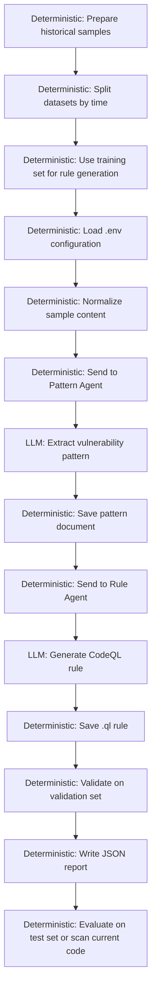

# FreeVRG

FreeVRG means `FreeBSD Vulnerability Rule Generator`.

[English](./README.md) | [简体中文](./README.zh-CN.md)

## Overview

This project is a prototype for turning historical FreeBSD vulnerability cases into reusable CodeQL rules.

The current goal is not to build a large platform first. The goal is to make the smallest useful pipeline work:

`sample -> pattern -> rule -> validation`

In this prototype:

- `Pattern Agent` reads structured vulnerability samples and summarizes reusable patterns
- `Rule Agent` turns patterns into CodeQL query prototypes
- `Validator` handles deterministic validation and result recording

## Workflow



Legend:

- `Model-involved`: pattern extraction and rule generation
- `Deterministic / hard-rule`: configuration loading, file IO, sample normalization, validation, and result recording

## Dataset Split

This project uses a time-based dataset split instead of a random split:

- `Training set`: older historical vulnerability samples used for pattern extraction and rule generation
- `Validation set`: mid-period samples used for recall checks, false-positive checks, and rule repair
- `Test set`: newer samples used to evaluate generalization, or to support more realistic scanning after validation passes

This avoids leaking very similar vulnerability patterns into both generation and evaluation. The project is trying to use past vulnerability knowledge to detect later variants, so a time-based split is more credible than a random split.

## Current Status

The repository is currently a prototype skeleton.

- directory structure is in place
- `.env`-based configuration is in place
- the main pipeline is wired together
- LLM calls and real CodeQL execution are still placeholders

## Project Structure

```text
FreeVRG/
  agents/
  core/
  data/
    samples/
    patterns/
    rules/
    results/
  prompts/
  main.py
  .env.example
  technical_design.md
```

Key directories:

- `agents/`: Pattern Agent and Rule Agent
- `core/`: config loading, orchestrator, validator
- `data/samples/`: structured historical vulnerability samples
- `data/patterns/`: generated pattern documents
- `data/rules/`: generated CodeQL rules
- `data/results/`: validation results and later scan outputs
- `prompts/`: prompt templates for the two agents

## Configuration

Runtime configuration is loaded from `.env`.

Start from:

```bash
cp .env.example .env
```

Important variables:

- `LLM_API_KEY`
- `LLM_BASE_URL`
- `PATTERN_MODEL`
- `RULE_MODEL`
- `PATTERN_TEMPERATURE`
- `RULE_TEMPERATURE`
- `MAX_REPAIR_ROUNDS`
- `CODEQL_PATH`

## Technology Choices

The current prototype stack is intentionally narrow:

- `PDM`: Python version and dependency management
- `LangGraph`: agent workflow orchestration and state transitions
- `Langfuse`: LLM trace, prompt, latency, and experiment observability
- local `Validator`: deterministic rule compilation and validation

The boundaries are explicit:

- `LangGraph` coordinates the `sample -> pattern -> rule -> validation` flow
- `Langfuse` observes agent execution, but does not replace validation logic
- `Validator` remains the deterministic control layer for compile, recall, and false-positive checks

## Quick Start

1. Copy `.env.example` to `.env`
2. Fill in model and API settings
3. Put a structured sample file into `data/samples/`
4. Run:

```bash
python main.py data/samples/<sample-file>
```

The current pipeline will:

- read the sample
- generate a pattern file
- generate a `.ql` file
- write a placeholder validation result

## Notes

- `technical_design.md` contains the current prototype architecture and workflow design
- generated artifacts under `data/patterns/`, `data/rules/`, and `data/results/` are runtime outputs
- historical samples under `data/samples/` are intended to be curated inputs
