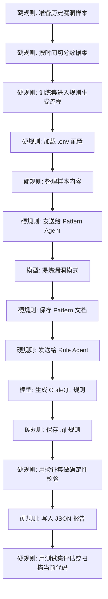

# FreeVRG

FreeVRG 的含义是 `FreeBSD Vulnerability Rule Generator`，即 `FreeBSD 漏洞规则生成器`。

[English](./README.md) | [简体中文](./README.zh-CN.md)

## 项目概览

这个项目是一个原型，用于将历史 FreeBSD 漏洞案例转换为可复用的 CodeQL 规则。

当前目标不是先搭建一个大型平台，而是先跑通最小可用链路：

`sample -> pattern -> rule -> validation`

在当前原型中：

- `Pattern Agent` 读取结构化漏洞样本并提炼可复用模式
- `Rule Agent` 将模式转换为 CodeQL 查询原型
- `Validator` 负责确定性校验与结果落盘

## 项目流程



说明：

- `模型参与`：漏洞模式提炼、CodeQL 规则生成
- `硬规则 / 确定性逻辑`：配置加载、文件读写、样本整理、规则校验、结果落盘

## 数据集切分

项目采用按时间切分数据集，而不是随机切分：

- `训练集`：较早年份的历史漏洞样本，用于模式提炼和规则生成
- `验证集`：中间年份样本，用于召回验证、误报验证和规则修正
- `测试集`：较新年份样本，用于评估规则泛化能力，或在规则通过验证后用于更接近真实场景的扫描测试

这样做是为了避免相近漏洞模式同时出现在生成阶段和评测阶段，导致结果失真。项目目标是用过去的漏洞经验发现后续同类问题，因此时间切分比随机切分更可信。

## 当前状态

这个仓库目前还是一个原型骨架，但已经把 `../FreeBSD/` 里的阶段性研究资产整理进来了。

- 目录结构已经就位
- 基于 `.env` 的配置加载已经就位
- 主流程已经串联完成
- LLM 调用和真实 CodeQL 执行仍然是占位实现
- 当前 v1 基线包含 62 条单 CVE、可提取的 C 样本
- 当前训练轮覆盖 33 条 train 样本，形成 27 个细粒度漏洞类
- PatternAgent 二次修订实验包包含 33 个实例分析、5 个多实例类层 pattern 和 grounding 日志
- 第一批 RuleAgent 只使用 2 个 PASS_STRICT 试点：
  - missing-array-bounds-check-on-network-controlled-index
  - missing-minimum-length-check-on-network-protocol-packet
- 当前 27 个细粒度类暂不立即合并；后续根据 RuleAgent 与 CodeQL 验证结果重组为更粗的漏洞族
- pattern grounding、RuleAgent 试点输入和首批 CodeQL 试点材料已经入库

## 项目结构

```text
FreeVRG/
  agents/
  codeql/
  core/
  data/
    samples/
    patterns/
    rules/
    results/
  docs/
  prompts/
  research/
  main.py
  .env.example
  technical_design.md
```

关键目录说明：

- `agents/`：`Pattern Agent` 与 `Rule Agent`
- `codeql/first-pilot/`：首批候选 CodeQL pack、说明、验证材料和最小 harness 源码
- `core/`：配置加载、流程编排、校验器
- `data/samples/`：结构化历史漏洞样本
- `data/patterns/`：生成的模式文档
- `data/rules/`：生成的 CodeQL 规则
- `data/results/`：校验结果以及后续扫描输出
- `docs/`：项目文档和导入后的研究笔记
- `prompts/`：两个 Agent 使用的提示词模板
- `research/`：整理后的 pattern grounding 数据和 RuleAgent 试点输入

## 已整理的临时工作

此前位于 `../FreeBSD/` 的临时工作已经按用途归档到仓库中：

- `research/pattern-grounding/`：训练集 CVE 的聚类修订版和 grounding 数据包。
  主要内容包括：`data/instances/` 下逐条 CVE 的分析记录、`data/patterns/` 下类级 pattern 文档、`_cluster_map.json`、`_rule_candidates.json`、`logs/grounding_train.txt` 以及 `scripts/grounding_check.py`。
- `research/rule-agent-pilot/`：基于两个 `PASS_STRICT` pattern 整理出的首批 RuleAgent 试点输入包。
  主要内容包括：各 pattern 目录下的 `rule_input.json`、模式摘要、`子模板/` 中的模板说明、`_class_family_map.json`、RuleAgent 输入输出规范、验证计划，以及 `rules/` 下的工作草案 `.ql`。
- `codeql/first-pilot/`：首批试点规则的 CodeQL 验证包。
  主要内容包括：`queries/` 下候选查询、`metadata/` 下来源和范围记录、`notes/` 下建模说明、`validation/` 下编译和 smoke 验证记录、`scripts/run_smoke_validation.sh`，以及 `minimal-validation-databases/source/` 下 5 个 CVE 的 vulnerable/fixed 最小 harness 源码。
- `docs/research-notes/`：从临时工作区导入的配套研究笔记。
  主要内容包括：项目背景、系统架构说明、数据集说明和 Pattern Agent 输入规范。

映射关系和未纳入版本控制的运行产物见 `docs/imported-assets.md`。

## 配置

运行时配置从 `.env` 读取。

先执行：

```bash
cp .env.example .env
```

重要变量包括：

- `LLM_BACKEND`：当前支持 `mock` 或 `openai-compatible`
- `LLM_API_KEY`
- `LLM_BASE_URL`
- `LLM_TIMEOUT_SECONDS`
- `PATTERN_LLM_BACKEND`：`Pattern Agent` 的可选覆盖配置
- `PATTERN_LLM_API_KEY`
- `PATTERN_LLM_BASE_URL`
- `PATTERN_LLM_TIMEOUT_SECONDS`
- `RULE_LLM_BACKEND`：`Rule Agent` 的可选覆盖配置
- `RULE_LLM_API_KEY`
- `RULE_LLM_BASE_URL`
- `RULE_LLM_TIMEOUT_SECONDS`
- `PATTERN_MODEL`
- `RULE_MODEL`
- `PATTERN_TEMPERATURE`
- `RULE_TEMPERATURE`
- `MAX_REPAIR_ROUNDS`
- `CODEQL_PATH`

配置规则：

- 全局 `LLM_*` 作为两个 Agent 的默认模型接口配置
- `PATTERN_LLM_*` 仅覆盖 `Pattern Agent`
- `RULE_LLM_*` 仅覆盖 `Rule Agent`
- 当 `LLM_BACKEND=mock` 时，流程不会请求远端模型，而是走本地确定性 fallback 生成逻辑

## 技术选型

当前原型刻意保持技术栈精简：

- `PDM`：Python 版本与依赖管理
- `LangGraph`：Agent 工作流编排与状态流转
- `Langfuse`：LLM 调用链路、提示词、延迟与实验观测
- 本地 `Validator`：确定性的规则编译与校验入口

各模块边界是明确的：

- `LangGraph` 负责协调 `sample -> pattern -> rule -> validation` 流程
- `Langfuse` 负责观测 Agent 执行，但不替代校验逻辑
- `Validator` 仍然是编译、召回率和误报检查的确定性控制层

## 快速开始

1. 将 `.env.example` 复制为 `.env`
2. 填写模型与 API 配置
3. 将结构化样本文件放入 `data/samples/`
4. 执行：

```bash
python main.py data/samples/<sample-file>
```

当前流程会：

- 读取样本
- 生成一个 pattern 文件
- 生成一个 `.ql` 文件
- 写入一个占位的校验结果

## 说明

- `technical_design.md` 包含当前原型架构与工作流设计
- `data/patterns/`、`data/rules/` 和 `data/results/` 下的内容属于运行产物
- `data/samples/` 下的历史样本属于人工整理输入
- 导入后的研究与试点资产位于 `research/`、`codeql/first-pilot/` 和 `docs/research-notes/`
