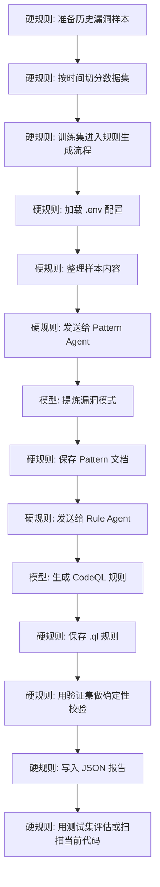

# FreeVRG

FreeVRG 的含义是 `FreeBSD Vulnerability Rule Generator`，即 `FreeBSD 漏洞规则生成器`。

[English](./README.md) | [简体中文](./README.zh-CN.md)

## 项目概览

这个项目是一个原型，用于将历史 FreeBSD 漏洞案例转换为可复用的 CodeQL 规则。

当前目标不是先搭建一个大型平台，而是先跑通最小可用链路：

`sample -> pattern -> rule -> validation`

在当前原型中：

- `Pattern Agent` 读取结构化漏洞样本并提炼可复用模式
- `Rule Agent` 将模式转换为 CodeQL 查询原型
- `Validator` 负责确定性校验与结果落盘

## 项目流程



说明：

- `模型参与`：漏洞模式提炼、CodeQL 规则生成
- `硬规则 / 确定性逻辑`：配置加载、文件读写、样本整理、规则校验、结果落盘

## 数据集切分

项目采用按时间切分数据集，而不是随机切分：

- `训练集`：较早年份的历史漏洞样本，用于模式提炼和规则生成
- `验证集`：中间年份样本，用于召回验证、误报验证和规则修正
- `测试集`：较新年份样本，用于评估规则泛化能力，或在规则通过验证后用于更接近真实场景的扫描测试

这样做是为了避免相近漏洞模式同时出现在生成阶段和评测阶段，导致结果失真。项目目标是用过去的漏洞经验发现后续同类问题，因此时间切分比随机切分更可信。

## 当前状态

这个仓库目前还是一个原型骨架。

- 目录结构已经就位
- 基于 `.env` 的配置加载已经就位
- 主流程已经串联完成
- LLM 调用和真实 CodeQL 执行仍然是占位实现

## 项目结构

```text
FreeVRG/
  agents/
  core/
  data/
    samples/
    patterns/
    rules/
    results/
  prompts/
  main.py
  .env.example
  technical_design.md
```

关键目录说明：

- `agents/`：`Pattern Agent` 与 `Rule Agent`
- `core/`：配置加载、流程编排、校验器
- `data/samples/`：结构化历史漏洞样本
- `data/patterns/`：生成的模式文档
- `data/rules/`：生成的 CodeQL 规则
- `data/results/`：校验结果以及后续扫描输出
- `prompts/`：两个 Agent 使用的提示词模板

## 配置

运行时配置从 `.env` 读取。

先执行：

```bash
cp .env.example .env
```

重要变量包括：

- `LLM_API_KEY`
- `LLM_BASE_URL`
- `PATTERN_MODEL`
- `RULE_MODEL`
- `PATTERN_TEMPERATURE`
- `RULE_TEMPERATURE`
- `MAX_REPAIR_ROUNDS`
- `CODEQL_PATH`

## 技术选型

当前原型刻意保持技术栈精简：

- `PDM`：Python 版本与依赖管理
- `LangGraph`：Agent 工作流编排与状态流转
- `Langfuse`：LLM 调用链路、提示词、延迟与实验观测
- 本地 `Validator`：确定性的规则编译与校验入口

各模块边界是明确的：

- `LangGraph` 负责协调 `sample -> pattern -> rule -> validation` 流程
- `Langfuse` 负责观测 Agent 执行，但不替代校验逻辑
- `Validator` 仍然是编译、召回率和误报检查的确定性控制层

## 快速开始

1. 将 `.env.example` 复制为 `.env`
2. 填写模型与 API 配置
3. 将结构化样本文件放入 `data/samples/`
4. 执行：

```bash
python main.py data/samples/<sample-file>
```

当前流程会：

- 读取样本
- 生成一个 pattern 文件
- 生成一个 `.ql` 文件
- 写入一个占位的校验结果

## 说明

- `technical_design.md` 包含当前原型架构与工作流设计
- `data/patterns/`、`data/rules/` 和 `data/results/` 下的内容属于运行产物
- `data/samples/` 下的历史样本属于人工整理输入
